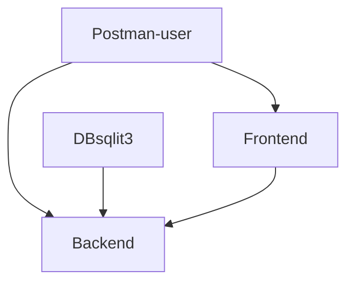

# Exame - Bexs DevOps

  

## Desafio

  

Considerando as aplicações presentes neste repositório detalhadas abaixo, precisamos de uma stack que permita a comunicação entre ambas e o acesso de desenvolvedores.

  

*  **Aplicação Frontend** - Aplicação em Python com Flask expondo na porta 8000 um formulário de criação de usuário contendo os campos ID e Name que realiza uma chamada Post com tais dados para a aplicação Backend.

  

*  **Aplicação Backend** - Aplicação em Go (Golang) expondo na porta 8080 o CRUD de Usuários e armazena em um banco Sqlite3 local.

  

## Como entregar sua solução?

  

1) Clone do repositório

  

2) Realize as alterações necessárias para construção/automação da stack. Considere um ambiente local (máquina do desenvolvedor) ou algum provedor de cloud (AWS ou GCP).

  

3) Adicione e commit todos os arquivos criados/alterados (todos mesmo)

  

4) Gere um patch conforme comando de exemplo abaixo

  

5) Nos envie o patch através do email que entramos em contato

  

*Para gerar o patch:*

```

git format-patch origin/master --stdout > seu_nome.patch

```

## Requisitos

  

* Não publique sua solução. Apenas nos envie o que desenvolveu.

* Crie imagens Docker para ambas as aplicações.

* Preencher este arquivo README.md com os detalhes, linha de raciocínio e dicas para os desenvolvedores que utilizarão sua solução.

* Considere que os desenvolvedores estão iniciando carreira e precisarão de mais detalhes de como executar sua solução.

* A Stack pode usar os recursos do próprio desenvolvedor(ex. VirtualBox, Docker, Docker-Compose) ou recursos de um provedor de cloud (Amazon Web Service ou Google Cloud)

* Não é necessário a criação de um pipeline. Considere que sua solução fará o bootstrap da Stack em questão.

* Não se preocupe em montar uma solução complexa. Dê preferência em montar uma solução simples que permita que o desenvolvedor realize melhorias.

* Apresente um desenho macro de arquitetura de sua solução.

  

## Bonus

  

* Sinta-se a vontade para realizar melhorias no código das aplicações, caso julgue necessário.

  

## Dúvidas

  

Entre em contato e nos questione.

## Possível solução

* As duas aplicações foram "dockerizadas" utilizei multi-stage builds para diminuir o tamanho da imagem do golang, no aplicação frontend.py foi necessário realizar a troca do módulo requests pelo urllib3 que já estava no requirements.txt para contornar o erro ERROR in frontend: HTTPConnectionPool(host='localhost', port=8080): Max retries exceeded with url: /users (Caused by NewConnectionError('<urllib3.connection.HTTPConnection object at 0x7fae8841a850>: Failed to establish a new connection: [Errno 111] Connection refused')) e assim foi possível subir a aplicação.
* No arquivo main.go tentei realizar uma alteração no código para ele poder receber o método PUT e alterar os usuário já existentes, porém deixei essa parte comentada e inseri dentro da função createUser a opção `statement  :=  "insert or replace into users (id, name) values ($1, $2)" ` que estava `statement  :=  "insert into users (id, name) values ($1, $2)"` Porém essa implementação do PUT não funcinou.

* Em ambas foram instaladas as dependências necessárias.

* Foram criados os seguintes arquivos um Dockerfile para cada aplicação e um docker-compose.yaml para cada aplicação.

## Forma para testar a aplicação

Baixe a aplicação

> git clone https://bitbucket.org/bexstech/bexs-devops-exam.git

bexs-devops-exam
├── backend
│   └── src
│       └── backend
│           ├── backend
│           │   ├── backend.db
│           │   ├── main
│           │   └── main.go
│           ├── docker-compose.yml
│           ├── Dockerfile
│           ├── main.go
│           └── README.md
├── frontend
│   └── src
│       └── frontend
│           ├── docker-compose.yml
│           ├── Dockerfile
│           ├── frontend.py
│           ├── frontend.py_bkp
│           ├── README.md
│           ├── requirements.txt
│           ├── static
│           │   ├── favicon.ico
│           │   └── style.css
│           └── templates
│               └── index.html
├── README.md
└── sobe_ambiente.sh

9 directories, 18 files

* Para o backend foram criados os arquivos Dockerfile que é a imagem da aplicação e o docker-compose.yml que cuida da orquestração da imagem, o mesmo para a aplicação frontend.

## Vamos subir o primeiro ambiente FE

Acesse o diretório onde a aplicação frontend está:
> cd frontend/src/frontend/

## Para executar

* É necessário ter instalado em sua máquina do [docker](https://docs.docker.com/install/linux/docker-ce/ubuntu/) e o [docker-compose](https://docs.docker.com/compose/install/)
* No linux não esqueça de conceder a permissão para que seu usuário possa executar o docker
> sudo usermod -aG docker your-user

E vamos gerar a imagem docker utilizando o comando docker build
> docker build -t frontend .

Dessa forma ao final teremos colocado todos os arquivos necessário para a aplicação frontend dentro da imagem docker.

Para ver a imagem:
> docker images | grep frontend
frontend           latest              0aa0a96eca5a        x hours ago        945MB

Se você quiser pode subir essa imagem "na mão" utilizando o seguinte comando:
> docker run  -p 8000:8000 frontend

Isso irá expor a porta 8000 em sua máquina e o acesso através da aplicação será possivel a partir do endereço http://localhost:8000

* Como temos o docker-compose instalado após realizar o build da imagem vamos executar o comando:
> docker-compose up

Com isso não será necessário realizar o comando "docker run" pois o docker-compose irá se encarregar disso.

Para identificar o serviço execute o comando:
> netstat -nltp | grep 8000
>
> tcp6       0      0 :::8000                 :::*                    LISTEN      -                   

Observe que a porta 8000 está ouvido, ou seja agardando conexão nela.

## Vamos subir o outro ambiente BE

Acesse o diretório onde a aplicação frontend está:
> cd frontend/src/backend/

E vamos gerar a imagem docker utilizando o comando docker build
> docker build -t backend .

Dessa forma ao final teremos colocado todos os arquivos necessário para a aplicação de backend dentro da imagem docker.

Para ver a imagem:
> docker images | grep backend
backend             latest              cfe06d877a92        x hours ago         21MB


Se você quiser pode subir essa imagem "na mão" utilizando o seguinte comando:
> docker run  -p 8080:8080 backend

Isso irá expor a porta 8080 em sua máquina e o acesso através da aplicação será possivel a partir do endereço http://localhost:8080

* Agora novamente com o docker-compose vamos rodar a imagem:
>docker-compose up

Com isso ele irá subir a imagem:

> netstat -nltp | grep 8080
>
> tcp6       0      0 :::8080                 :::*                    LISTEN      -            

Cada aplicação tem o seu arquivo   "docker-compose.yml"


Com as duas aplicações no ar, "up" é possível realizar os seguintes operações para validação e utilização:

* Health check da aplicação de BE - [http://0.0.0.0:8080/healthz](http://0.0.0.0:8080/healthz)
>$ curl [http://0.0.0.0:8080/healthz](http://0.0.0.0:8080/healthz)
>ok

* Busca de usuários - [http://0.0.0.0:8080/users](http://0.0.0.0:8080/users)
>$ curl [http://localhost:8080/users](http://localhost:8080/users)
>[{"id":1,"name":"Nelson"},{"id":2,"name":"leonardo"}]

 * Busca usuário por id - [http://0.0.0.0:8080/users/](http://0.0.0.0:8080/users/){id:[0-9]+}
>$ curl [http://localhost:8080/users/1](http://localhost:8080/users/1)
>{"id":1,"name":"Nelson"}
>
>$ curl [http://localhost:8080/users/2](http://localhost:8080/users/1)
>{"id":2,"name":"leonardo"}

  * Cria usuários - [http://0.0.0.0:8080/user](http://0.0.0.0:8080/user)
 > $ curl -d '{"id": 1, "name": "Nelson"}' -H "Content-Type: application/json" -X POST [http://localhost:8080/users](http://localhost:8080/users)
> $ curl -d '{"id": 2, "name": "leonardo"}' -H "Content-Type: application/json" -X POST [http://localhost:8080/users](http://localhost:8080/users)

Isso pode ser testado através da linha de comando ou através do [Postman](https://www.getpostman.com/)

* O Postman ou o usuáro realiza o acesso à aplicação através do front end este por sua vez se comunica com o back end e a sua base de dados que fica dentro dele mesmo. O postman para utilização ou testes também tem acesso ao backend.

## Para subir a aplicação de uma forma automática

* Utilize o script sobe_ambiente.sh

Passe a permissão de execusão no script
>chmod +x sobe_ambiente.sh
>./sobe_ambiente.sh


